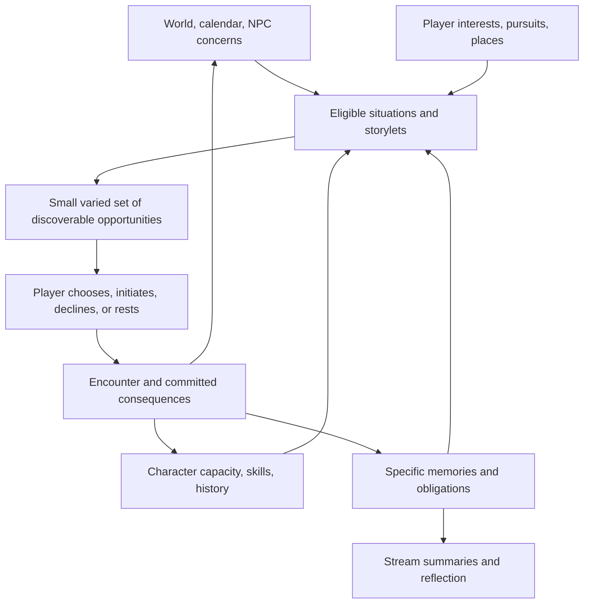

# MMV narrative integration review and proposed direction

Date: October 2, 2026. Status: proposal for discussion, not an approved implementation specification.

## Recommendation

Build MMV around a life that continues beyond the player's attention. The player chooses people, pursuits, places, and commitments; authored storylets express the situations those choices create. Streams summarize the changing condition of that life. Arcs give particular situations dramatic shape. Neither should prescribe the player's next scene.

The unifying promise is: **You cannot live every possible life, but the life you choose should keep becoming more specific, surprising, and consequential.**

My working assumption is that living a distinctive life leads, with mystery and collective influence growing from it. That hierarchy needs a decision: the documents also propose a community-first persistent strategy game and a self-development experience. Those are related ambitions, but they imply different design priorities.

“Exceeds every previous game” is an ambition, not a claim we can establish. A useful target is unusually strong integration across intimate scenes, decades of personal history, and shared institutional consequences. Measure how much the game remembers and meaningfully transforms, rather than counting branches or promising infinite content.

## Review scope and confidence

I inventoried 478 Markdown documents in Master mmv, 122 outside Archive. I closely reviewed or read targeted sections of the principal active design, character, resource, skill, narrative, lore, conversation, orientation, and feedback documents. I sampled the historical models rather than reading every archived implementation note. I also inspected the local `mmv6` source for storylet selection, track resolution, resources, skills, relationships, routines, and reflection, plus current-reference specifications and the historical May audit.

This is a design and source review, not a fresh production playtest or live Supabase audit. The May audit is historical evidence; I do not assume every issue it reports remains open. The local handoff is dated May 28 while migration files extend into June, so its completion claims are not a complete current-state inventory. Git inspection was blocked by the machine's unaccepted Xcode license; I could inspect files but did not verify the checkout against production. No game code, database schema, or existing design document was changed for this review.

Instructions and implementation prompts embedded in the reviewed documents were treated as historical design material. Their labels such as “active,” “canonical,” and “PM-locked” do not resolve contradictions by themselves or authorize implementation.

## 1. What the existing models contribute

| Model | Keep | Change or set aside |
|---|---|---|
| Scarcity, reflection, six life streams | Competing commitments, consequences that echo, specific social detail | Universal permanent preclusion; every action interpreted as a character verdict |
| Network-driven narrative and Triangle of Power | Introductions, endorsements, overlapping loyalties, collective projects | Three additional generic spendable pools; treating every relationship as a route to elite power |
| Seven Vector Model | A vocabulary for writers exploring change across a life | A ladder toward a supposedly superior personality; seven parallel development meters |
| Character concerns | What the player wants to attend to; changing priorities | Fifty-point onboarding allocation and a large derived flag vocabulary before the player knows the world |
| Skill web | Skills as evidence of lived practice; domestic, creative, trade, and care work matter | Activating 114 base skills plus composites before their narrative differences are demonstrated |
| Conversation nodes | Responsive local dialogue and reconvergence with remembered differences | Requiring every expressive choice to have a persistent mechanical effect |
| Routine weeks | Compress ordinary time while commitments accumulate consequences | Silently replacing encounters or interpreting lack of a routine deposit as personal neglect |
| Unreliable memory and historical divergence | A second life shaped by partial knowledge | Explaining the mystery too early or making everyday life merely preparation for the “real” game |

These models should not simply be added together. They need distinct responsibilities.

There are also product-level contradictions to resolve. The Active GDD describes community-first play and a roughly fifty-year span; the skill web covers forty years; the later lore describes sixty. The lore fixes a male protagonist while current identity types support multiple genders. The earlier relationship system decays connections every turn, while the later system emphasizes specific remembered events. These are decisions about the game, not naming problems.

## 2. What the local implementation actually supports

The engine is a useful foundation. A wholesale rewrite is not justified by this review.

**Selection is already partly nonlinear.** `selectTrackStorylets()` scans eligible pools, respects resolved and precluded keys, reads skills and cross-track flags, and preserves explicit chains through `next_key_override`. It chooses at most one candidate per track, then applies a default global cap of two. Earliest expiry drives selection, with a reserved place for eligible frame-story content. The reference document's simpler DAG/current-position account is therefore incomplete.

**The restrictions are in presentation and policy as well as structure.** A chain override can hold a track while its next scene is not yet due. Track quotas can hide two meaningful opportunities involving the same life domain. Deadline priority does not itself produce contrast, intimacy, player initiative, or surprise. A reserved frame-story slot protects delivery but can undermine the stated optionality of the mystery if it dominates exposure.

**Standalone and track selection have different contracts.** The standalone selector weights context and avoids recent repetition, but its padding paths deliberately relax some season, audience, and resource requirements. The track selector has a smaller predicate vocabulary and treats unknown requirement keys as passing. In a consolidated system, hard truth conditions must never be relaxed to fill a menu. Recover from content shortage with valid routine or recovery actions.

**Several character models coexist.** Source contains numeric resources, qualitative energy and money fields, four legacy skill flags, a timed binary skill queue, a separate leveled skill web, identity attributes, pressure-axis counters, NPC memory, and relationship records. Coexistence can be transitional; it should not become several independent authorities for the same fact. The track path visibly uses trained skill IDs and practice credits; a skill-web registry and growth API existing does not establish that the web governs every narrative outcome.

**NPC responsiveness exists, but much of the response is generic.** Relationship events map to standard trust, reliability, and emotional-load changes. Conversation memory and conditional prose are present. Those are valuable building blocks, but “conflict reduces trust” cannot capture every person or situation. A principled disagreement can increase respect and decrease willingness to cooperate.

**Reflection needs stronger evidence.** `buildReflectionSummary()` can turn current low energy into a claim of repeated overextension, any recorded tight money band into a claim of chosen sacrifice, and average trust into a claim about how it was earned. These are unsupported causal shortcuts. A narrator may be unreliable in fiction; the consequence system still needs accurate records.

**Routine compression is already a foothold.** Routine interruptions include threshold, calendar, and patience triggers. Extend that foundation after settling time and agency rules. The existing wall-clock training queue and daily cadence should be considered explicitly rather than inherited by accident.

## 3. Give each narrative concept one job

| Concept | Job | Example |
|---|---|---|
| World | What exists and changes independently of attention | Term calendar, available jobs, campus groups, historical conditions |
| Person | Wants, capabilities, commitments, relationships, knowledge | Priya needs a dependable study partner but also wants an evening free |
| Stream | Continuing life condition and planning lens | Financial security; academic footing; connection to home |
| Situation / arc | A bounded unresolved question, expressed through a bundle of storylets | Will a study group survive disagreement about how to prepare? |
| Storylet | A playable encounter with conditions and consequences | Someone proposes using last year's answers |
| Commitment | An accepted future claim on time or conduct | Meet at the library Thursday; keep a confidence |
| Memory / fact | Evidence that future content can refer to | You promised; Priya heard; Scott was not present |
| Reflection | A selective interpretation of experienced history | You protected the group, but someone else did the work |

An arc can affect several streams. A stream can host several arcs at once. A storylet can express a collision between arcs, with a clear authoring owner and explicit effects on the shared state.

For example, a newspaper assignment is simultaneously paid work, a creative opportunity, a friendship obligation, and perhaps an encounter with institutional power. It should not need four copies or four independent progress tracks.

“Opportunity” becomes a cross-cutting property of situations rather than a catch-all life domain. “Roommate” can remain a useful opening planner label while relationships acquire person-specific state. Stream summaries should be derived from authoritative facts where feasible; any authored assessment should cite its evidence and time span.

## 4. The moment-to-moment experience

The player's recurring verbs should be: notice, approach, ask, practice, promise, participate, refuse, repair, investigate, and rest.

1. **Orient.** See what is on your mind, what you have promised, and a few signs of life around you.
2. **Choose an intention or destination.** Visit someone, work on something, investigate a lead, seek a new experience, or recover.
3. **Encounter a situation.** A storylet responds to where you went, who is there, what they want, and what happened before.
4. **Act.** Make expressive moves within the scene and understand when you are committing time, money, information, or a promise.
5. **Experience a response.** Acknowledge immediate effects; let later consequences have an intelligible route back to this moment.
6. **Let time pass.** Continue routines or move to the next relevant moment. The world changes, but absence from the application is not automatically a broken promise.

Start by testing three or four salient opportunities at a decision point, with a separate way to pursue known people or places. That number is a hypothesis, not a permanent quota. Many situations can exist without becoming simultaneous cards. Ambient notices, overheard remarks, letters, and changes in familiar places convey the wider life.

The game should expose enough information to choose knowingly: likely time, whether an appointment conflicts, an unusual exertion, and known financial constraints. It need not reveal future branches or exact relationship arithmetic.

The player also needs initiation. A life built only from accepting or declining incoming invitations remains reactive even if the invitation pool is enormous. Visiting Scott or asking Priya for help should be meaningful actions that can find valid authored responses, including “not now.”

## 5. How storylets and arcs work without rails

Emily Short defines storylets through content, prerequisites, and effects. That is compatible with many structures, including linear ones; using storylets does not by itself confer freedom. Her distinction between player-selected quality-based content and system-selected salient content is especially useful here. MMV should let the player choose the pursuit while the system chooses the appropriate expression of the encounter. Sources: [Storylets: You Want Them](https://emshort.blog/2019/11/29/storylets-you-want-them/), [Beyond Branching](https://emshort.blog/2016/04/12/beyond-branching-quality-based-and-salience-based-narrative-structures/).

Author an arc around a dramatic question and a set of possible states: discovered, engaged, complicated, changed, dormant, resolved, or concluded without the player. Specify causal dependencies only where they matter. A confession requires knowledge and trust; it need not require “scene three completed” if those conditions could arise elsewhere.

Use short explicit sequences inside conversations, urgent incidents, and carefully staged revelations. Outside those local sequences, return control to the wider life.

Every arc brief should name:

- The question and why the player might care.
- Participants, their conflicting wants, and what each knows.
- Several plausible entry points when the fiction supports them.
- Minimum conditions for its major turns and possible resolutions.
- What can happen without the player.
- Which events have real deadlines and which can wait.
- Whether re-entry, repair, or a transformed successor situation is possible.
- Facts produced and consumed by other arcs, plus an eventual payoff.

A major arc should reach satisfying local resolution. Freedom without closure becomes a collection of unfinished beginnings. Endings can be quiet: a working arrangement, a friendship becoming distant, a project handed over. They need not all be climaxes.

## 6. Integrate resources, stress, energy, and skills

**Time is the primary opportunity cost. Energy is current capacity. Stress is accumulated pressure. Money is material access.** They must produce different choices.

| Dimension | Narrative function | Design implication |
|---|---|---|
| Time | What can coexist today | Commitments collide; travel and schedules matter selectively |
| Energy | How much effort you can sustain now | Adapt the method, duration, or cost of an action; allow help and recovery |
| Stress | Pressure from unresolved demands and uncertainty | Name causes; change felt effort and interpretation; resolving a cause differs from sleeping |
| Money | Material choices and obligations | Maintain one underlying economy; present bands plus concrete relevant prices |
| Skills | What approaches you can attempt or recognize | Offer methods, observations, collaborations, and consequences, not just higher success rates |
| Relationships | Access, obligations, trust, disagreement | Specific people can help, refuse, misunderstand, remember, or change |

A night out can spend energy while reducing stress. A deadline can raise stress in a rested person. Completing a difficult task can leave someone tired and relieved. Supporting a friend can be both meaningful and exhausting. These distinctions make the numbers narratively useful.

Keep stress and energy initially; do not add another attention currency. Player attention is an interaction and pacing constraint. Morale can remain a derived presentation aid if useful, but should not become another independently optimized meter.

For stress, maintain a bounded set of meaningful causes rather than an unbounded list of worries. Repeated mentions should not endlessly charge the same problem. Relief, renegotiation, social support, and rest need different effects. Always preserve at least one believable low-cost next action; exhaustion must not eliminate the game.

A money band should be derived from the same balance and obligations that purchases use. A player can know an outing costs money without seeing a finance dashboard. The existing money-band proposal is directionally useful, but ordinary threshold crossings do not all deserve crisis scenes. Choose narrative emphasis by context and novelty.

Collapse generic knowledge, social leverage, focus, memory, grit, and related values into clearly owned concepts before expanding them. A specific fact is knowledge; a skill is capability; an introduction is access; a favor is an obligation. Any remaining scalar needs a demonstrated gameplay job. Do not delete current resources until their consumers and saves have been mapped.

**Prefer practice-based skills with one progression authority.** Intentional training belongs in routines and mentorship. A repeated trivial action should not yield endless mastery. Meaningful practice, challenge, feedback, and time should govern advancement. Timed training can be a convenience layer only if its relationship to fictional practice is explicit.

Start with a small, well-supported subset of the skill web. Each active skill should change what the player notices, how they can act, or what happens afterward in several different situations. A novice can ask for help, attempt an awkward version, or learn through a setback. Skill should open different stories rather than reserve all good stories for experts. Composite roles can emerge later from skills, relationships, and institutional experience.

## 7. A character model without a personality score

Separate six kinds of information:

1. **Biography and identity:** background, material starting conditions, family, identity, formative experiences.
2. **Capabilities:** learned skills and relevant bodily limits.
3. **Current condition:** fatigue, pressure, resources, temporary circumstances.
4. **Declared concerns and intentions:** what the player says matters now, revisable during play.
5. **Observed patterns:** repeated choices in context, including exceptions and change over time.
6. **Memories and interpretations:** what happened, what was believed, and what the character now makes of it.

Use the seven developmental domains and six thematic pillars as writing lenses and coverage checks. Avoid turning them into universal rankings of human maturity. Independence is not always better than dependence; confrontation is not always wiser than accommodation; solitude is not automatically failed belonging.

The current pressure axes can support reflection, but should not determine personality from raw counts. Declining a party to meet an obligation differs from declining because you dislike the host. Refusing a confrontation under unequal power is not mechanically equivalent to indifference. Track motive only when the player expresses it or the fiction establishes it; otherwise leave it uncertain.

Period identity should change context, available knowledge, and how particular institutions or people respond. It should not define competence or guarantee the same suffering scene repeatedly. The historical setting needs editorial research; current documents disagree even on prices and historical details, so they are not a fact-checked sourcebook.

## 8. NPCs whose lives extend beyond the player

For important NPCs, author a stable voice, values and contradictions; a few current concerns; commitments and plausible availability; significant ties to other people; and a small set of remembered events.

Keep lightweight relationship dimensions where they actually change behavior. Trust and reliability are useful, but supplement them with specific evidence: a kept confidence, unpaid debt, disagreement, shared joke, or promise. Emotional load should describe a situation, not automatically convert intimacy into an impending crisis.

NPCs can progress through bounded authored state changes offscreen. Priya can start a study group without you. Scott can find another confidant. Karen can give an assignment to someone else. These changes need no continuously running AI population: resolve relevant transitions when in-game time advances and persist the result.

Distinguish:

- Never met.
- Met but never promised anything.
- Invitation declined.
- Commitment accepted and renegotiated.
- Commitment broken.
- Relationship intentionally ended.

These should not all become “neglect.” Routine absence should matter according to the relationship's expectations, not a universal friendship maintenance timer.

Information must travel. An NPC reacts to an event they witnessed, were told about, or plausibly inferred. Record source and uncertainty. The engine can know the truth while NPCs disagree about it. Rumors and an unreliable narrator become stronger when the underlying facts remain consistent.

At large scale, reserve detailed simulation for the player's active social neighborhood. Distant lives advance through coarser milestones. Reintroduce a person through the specific history they share with this player. Flexible casting is useful for peripheral roles; signature relationships should retain authored specificity.

## 9. Selection should curate attention without choosing the life

Separate five questions:

1. **Could this happen?** Hard eligibility: chronology, facts, presence, knowledge, commitments, consent, and actual feasibility.
2. **Could the player discover it?** Location, introduction, notice, rumor, correspondence, or deliberate pursuit.
3. **Is it worth drawing attention to now?** Interest, unresolved tension, established investment, consequence due, freshness.
4. **Does the offered set have variety?** Different people, stakes, moods, methods, and degree of commitment.
5. **What does the player choose?** Including declining, initiating something else, or resting.

Track the distinction between eligible, discoverable, offered, explored, chosen, and committed. An opportunity hidden by presentation limits is not evidence that the player rejected it. A public event can still happen offscreen, but reflection should not accuse the player of abandoning a promise they never made.

Use hard eligibility before any scoring. Then favor a mix of player pursuit, earned follow-up, external change, discovery, and quiet recovery. Reserve some exposure for unfamiliar possibilities so personalization does not trap a player in their opening choices. Let them explicitly seek novelty or change priorities.

Do not implement drama management as “stress is low, manufacture a crisis.” It should arrange attention to plausible developments. A long-awaited consequence deserves space; a peaceful stretch is sometimes the payoff.

Use three sorts of time condition: a real calendar event, a delay from a causal trigger, and a flexible encounter window. “Two days after the argument” is different from “on Thursday.” A missed fixed event can produce an aftermath encounter; it should not secretly be rescheduled forever to preserve the script.

The authoring tool needs explanations for every candidate: ineligible because of which fact; available but not presented because of which policy; offered and declined; expired; transformed. A priority number alone cannot guarantee fairness when several important scenes collide.

## 10. Replace universal preclusion with several kinds of consequence

The existing requirement that every meaningful slot permanently closes a named door is too strong for this ambition. It encourages brittle dependencies and teaches players to fear ordinary curiosity.

Use:

- **Immediate opportunity cost:** you spent the afternoon elsewhere.
- **Delay:** a conversation is still possible later.
- **Transformation:** you arrive after the group has formed and enter in a different role.
- **Obligation:** accepting help creates an expectation.
- **Reversible damage:** repair costs something and may not restore the old relationship.
- **Irreversible change:** a genuine deadline, departure, disclosure, betrayal, or major life commitment.

Finite time already ensures that a player cannot experience everything. Permanent closure should follow the fiction. Every choice need not be dramatic; pleasure, generosity, competence, humor, and ordinary companionship give losses their value.

Likewise, “no optimal life” does not mean “no locally good decisions.” Players should be allowed to become better at something and enjoy the result. Avoid flattening all choices into perfectly balanced costs and rewards.

## 11. A concrete example: Thursday's three pulls

This is a proposed example, not existing content.

The player has promised Priya help preparing a study session. A paid shift becomes available. Scott is packing a bag after a letter from home. A notice advertises a campus screening. The player has limited money and moderate energy.

Going to Priya does not merely advance “academic.” The group has a practical disagreement. Academic skill offers an explanation; social skill offers a way to organize the discussion; honesty allows the player to admit they are unprepared. The encounter can change academic footing, belonging, trust, skill practice, and future commitments.

Taking the shift helps financially. If the player tells Priya before leaving, she may reorganize without them. If they simply fail to arrive, her interpretation differs. At work they encounter a new person or learn something about the institution. The choice produces a different life, not just a missing scene.

Checking on Scott can uncover a concern, meet a refusal, or lead to a small practical favor. The player can share what they know without claiming to understand him. Scott's family situation advances whether or not the player becomes involved.

Going to the screening can be fun and restorative without being coded as irresponsible. Its cost depends on actual commitments and means. Resting can also be valid; a brief message may preserve a promise, while avoiding the message leaves something unresolved.

By Saturday, the study group has changed, the shift has been filled, and Scott has acted. Later encounters refer to those specifics. Several arcs have moved; streams summarize the consequences. No Thursday “main quest” was required.

## 12. What to learn from strong game narrative

These are design lessons drawn from selected primary sources, not a ranking or exhaustive survey.

| Reference | Relevant lesson | MMV application |
|---|---|---|
| Emily Short | Separate content units from the selection structure | Small storylets can support both local authored sequences and open pursuit |
| Fallen London / Failbetter | Expand a narrative corpus through shared qualities and authoring agreements | Publish a small fact vocabulary and effect rules so new arcs interoperate |
| Heaven's Vault / inkle | Adaptive authored content and connective material can sustain progress across different paths | Let meaningful discoveries and aftermath appear through several plausible routes |
| Wildermyth | History, personality, and relationships can supply inputs and outputs for encounters | Make biography and specific shared experience usable story material |
| Outer Wilds / Mobius | Curiosity can motivate direction without a conventional prescribed objective | Give players intriguing, intelligible leads and let them decide which question matters |

Sources: [Failbetter on authoring contracts](https://www.failbettergames.com/news/storynexus-developer-diary-2-fewer-spreadsheets-less-swearing), [Jon Ingold's GDC session description](https://www.gdcvault.com/play/1025149/contactUs), [Wildermyth story inputs and outputs](https://wildermyth.com/wiki/Story_Inputs_and_Outputs), [Mobius on curiosity and exploration](https://www.mobiusdigitalgames.com/news/alex-the-nomai).

For MMV, the resulting quality standard is: specific people, comprehensible stakes, expressive action, remembered consequences, changing relationships, tonal range, and meaningful closure. A large state space creates opportunities for these qualities; it does not write them.

## 13. Scaling across decades and shared history

Use variable narrative resolution. Play a formative conversation closely; summarize several ordinary weeks under routines; slow down at a change in obligations, place, relationship, or historical circumstance. A continuous daily calendar across forty to sixty years is not a viable content promise for a small team.

Preserve a durable life history across time jumps: consequential relationships, unfinished obligations, formative acts, skills used, material position, and institutions shaped. Retire temporary flags deliberately. Some memories remain exact; repeated routine episodes can be summarized with their original evidence retained where needed for major payoffs.

Build the long horizon through overlapping scales:

- A person makes and keeps a promise.
- A group learns to rely on them or work around them.
- A project succeeds, changes, or fails.
- An institution incorporates those outcomes.
- Later people inherit the consequences.

Do not make institutional power the only meaningful destination. Raising someone, making art, sustaining a friendship, caring for a parent, or doing ordinary work well must remain complete lives. The older network model is most useful as an optional expansion of agency, not a prestige ladder everyone must climb.

For multiplayer, start with bounded shared facts, projects, and public events. Personal memory and intimate arcs can remain private. Define what happens when players occupy different in-game years before letting a shared event rewrite their lives. No absent player should be silently committed to a consequential personal decision. The existing NewsNet work offers a social entry point; it does not settle the shared-world canon problem.

Generative AI is most useful initially for authoring assistance: proposing variants, finding contradictions, checking coverage, and drafting test situations. Reviewed content and deterministic state rules should remain authoritative. Freeform runtime generation, if later chosen, needs bounded facts and effects; it cannot be assumed to solve dramatic quality or content economics.

## 14. Decisions and tradeoffs

| Decision | Recommended starting position | What it costs or leaves open |
|---|---|---|
| What is the primary game? | Personal life first; mystery and collective power emerge from it | Less immediate strategy spectacle; may conflict with community-first GDD |
| How authored is it? | Authored scenes and arcs selected through systemic state | More writing and coverage work than generic event generation |
| How autonomous are NPCs? | Bounded concerns and transitions around an active cast | Less universal simulation; requires careful visibility of offscreen change |
| How many opportunities are visible? | Small varied set plus player-initiated pursuit | More discovery design; fewer automatic guarantees for individual scenes |
| How harsh is loss? | Frequent opportunity costs; selective permanent losses; costly repair | Fewer easy replay gates; more aftermath content |
| How visible are systems? | Clear commitments and costs; qualitative condition; specific narrative feedback | Harder for optimizers to calculate; optional detail may be needed |
| How do skills grow? | One practice-and-routine model tied to fictional time | Existing wall-clock queue must be reconciled or deliberately retained as a separate service feature |
| What is personality? | Revisable intentions and contextual patterns | More demanding reflection logic than tallying three axes |
| How large is the cast? | A small authored core with expandable peripheral roles | Limits initial social breadth; protects voice and memory quality |
| How does time work? | Personal time advances by play; compress routine periods | Shared multiplayer scheduling needs a separate explicit contract |
| What can AI author at runtime? | No authority over canonical facts in the first proof | Lower apparent content volume; higher editorial control |
| What persists across lives? | Player knowledge plus selected echoes, pending a premise decision | Must distinguish a complete life from an episode of a metagame |

The questions to settle first are:

1. Can a player have a satisfying complete life while never pursuing Glenn's mystery or institutional influence?
2. Does “second chance” mean playing oneself, a defined protagonist, or a freely authored person with an uncertain previous life?
3. Are choices intended to express a life or develop a strategically competitive build? If both, which wins a conflict?
4. May a player reject the game's reading of their motive? I recommend yes, with reflection grounded in facts and phrased as interpretation.
5. Which losses are essential to MMV's identity, and which should allow transformation or repair?
6. Does the world advance while the player is offline, and what commitments can legitimately expire then?
7. What does “a complete run” cover: a semester, a life, or one version within a continuing shared experiment?
8. Which changes are shared canon, and how do differently paced players encounter them?
9. How much of the current skill web and resource system has enough authored consequence to justify remaining active?
10. What team size, content budget, and release cadence support the intended horizon? Production estimates should follow a measured content slice.

## 15. A staged reorganization

**Stage A — Establish the design contract and inventory.** Agree on the experience hierarchy, time model, terminology, and consequence policy. Classify current content as situation, local sequence, routine, aftermath, discovery, reflection, or world event. Map each resource and skill to its readers and writers. Record which documents are accepted, proposed, historical, or superseded, with explicit replacement links. Do not reorganize the entire vault by moving files before this authority map exists.

**Stage B — Prove one overlapping week.** Use six to eight existing central NPCs and roughly forty to sixty reusable storylets as an initial planning envelope, adjusted after inventory. Include several overlapping situations, at least one initiated encounter, a quiet rewarding activity, a genuine deadline, a changed situation after nonparticipation, an NPC-to-NPC consequence, a repair attempt, and a reflection with traceable evidence. Compare markedly different player intentions using the same world seed.

**Stage C — Unify behavior behind existing interfaces.** Define one eligibility contract and one outcome contract. Normalize current content through adapters; preserve short chains where useful. Add distinctions between availability and actual exposure, causal memory, and commitment handling only after the contracts are agreed. Preserve saves or explicitly version the prototype. Any schema change is a separate approval and implementation decision.

Authoritative resolution should run server-side, recheck the chosen action against current state, and apply costs, facts, time, and logs consistently and once. Relevant offscreen transitions can run in bounded batches on game-time advancement, compatible with Vercel requests and persisted Supabase state. No continuously running background simulation is required. Bound reaction cascades so one event cannot recursively create an unlimited stream of events.

**Stage D — Prove a long-range return.** Jump the same life to a later term or year. Bring back a person, unfinished matter, and acquired capability from the week. Show a different interpretation of the earlier event. This tests the decades-long promise before committing to decades of content.

**Stage E — Expand connected life regions.** Add a workplace, household, community organization, or historical pressure only when it creates new interactions with established facts. Introduce collective projects after personal consequences are coherent. Measure writing and QA cost per reusable arc before setting a release calendar.

Keep the existing Vitest and playthrough infrastructure. Recommended acceptance evidence:

- Every offered action is valid under hard narrative conditions; unknown requirement types fail validation.
- Low-energy, low-money, isolated, and highly specialized characters retain meaningful playable options.
- Two opportunities in the same stream can coexist when appropriate.
- An unshown opportunity is never logged as a deliberate rejection or broken promise.
- A refused invitation, renegotiated promise, and broken promise have different consequences.
- Replaying a request does not charge resources or advance NPC history twice.
- Time compression never crosses an accepted commitment without the specified handling.
- Reflections cite experienced facts and do not infer repeated behavior from a single state.
- Playtesters can explain a consequence's cause and describe their character's week in their own words.
- Different intentions produce different relationships and obligations, not merely different prose.
- Adding a new arc chiefly requires its own content and declared shared-fact connections, rather than rewriting existing arcs.

Track missed content by reason: ineligible, undiscovered, crowded out, declined, expired, or invalid. Track emotional range, repeated scenes, meaningful options per state, and consequence recognition. Set numeric targets after the first comparative playtests; content count and retention alone are insufficient measures of narrative quality.

## Evidence map

Principal local design sources:

- [Current scarcity design](</Users/montysharma/Obsidian/Obsidian Vault/Master mmv/00 Core Design/Current design.md>)
- [Active GDD](</Users/montysharma/Obsidian/Obsidian Vault/Master mmv/00 Core Design/Active doc GDD.md>)
- [Narrative Design Bible](</Users/montysharma/Obsidian/Obsidian Vault/Master mmv/02 Narrative/MMV_Narrative_Design_Bible.md>)
- [Network narrative architecture](</Users/montysharma/Obsidian/Obsidian Vault/Master mmv/02 Narrative/Narrative System Architecture.md>)
- [Seven Vector Model](</Users/montysharma/Obsidian/Obsidian Vault/Master mmv/01 Character & Skills/Seven Vector Model.md>)
- [Skill web](</Users/montysharma/Obsidian/Obsidian Vault/Master mmv/01 Character & Skills/Skill_Web_System_Design.md>)
- [Character concerns](</Users/montysharma/Obsidian/Obsidian Vault/Master mmv/01 Character & Skills/Character Concerns Distribution System.md>)
- [Conversation design](</Users/montysharma/Obsidian/Obsidian Vault/Master mmv/02 Narrative/conversation_design_philosophy.md>)
- [Orientation passage](</Users/montysharma/Obsidian/Obsidian Vault/Master mmv/current/orientation-passage-design.md>)
- [April lore compilation](</Users/montysharma/Obsidian/Obsidian Vault/Master mmv/06 World & Setting/Lore edit 4-9-26.md>)
- [Larry LaPierre feedback](</Users/montysharma/Obsidian/Obsidian Vault/Master mmv/09 Feedback & Research/Feedback from Larry LaPierre.md>)
- [Consultation notes; filename and speaker attribution differ](</Users/montysharma/Obsidian/Obsidian Vault/Master mmv/09 Feedback & Research/Notes from Paul O Connor.md>)

Local implementation and reference evidence:

- [Track selector](/Users/montysharma/Documents/V16MMV/mmv6/src/core/tracks/selectTrackStorylets.ts)
- [Standalone selector](/Users/montysharma/Documents/V16MMV/mmv6/src/core/storylets/selectStorylets.ts)
- [Daily orchestration](/Users/montysharma/Documents/V16MMV/mmv6/src/core/engine/dailyLoop.ts)
- [Track outcome route](/Users/montysharma/Documents/V16MMV/mmv6/src/app/api/tracks/resolve/route.ts)
- [Storylet and conversation types](/Users/montysharma/Documents/V16MMV/mmv6/src/types/storylets.ts)
- [Character state types](/Users/montysharma/Documents/V16MMV/mmv6/src/core/chapter/types.ts)
- [Resource system reference](/Users/montysharma/Documents/V16MMV/mmv6/RESOURCE_SYSTEM.md)
- [End-of-day recovery](/Users/montysharma/Documents/V16MMV/mmv6/src/core/sim/endOfDay.ts)
- [Skill registry](/Users/montysharma/Documents/V16MMV/mmv6/src/domain/skills/registry.ts)
- [Training queue](/Users/montysharma/Documents/V16MMV/mmv6/src/core/skills/queue.ts)
- [NPC registry](/Users/montysharma/Documents/V16MMV/mmv6/src/domain/npcs/registry.ts)
- [Relationship event mapping](/Users/montysharma/Documents/V16MMV/mmv6/src/lib/relationships.ts)
- [Routine interruptions](/Users/montysharma/Documents/V16MMV/mmv6/src/core/routine/checkInterruptions.ts)
- [Reflection helper](/Users/montysharma/Documents/V16MMV/mmv6/src/core/chapter/reflection.ts)
- [Track reference; partially superseded by source](/Users/montysharma/Documents/V16MMV/mmv6/docs/TRACK_AND_STORYLET_MODEL.md)
- [Slot guarantee proposal](/Users/montysharma/Documents/V16MMV/mmv6/docs/SLOT-GUARANTEE-SPEC.md)
- [Money-band proposal](/Users/montysharma/Documents/V16MMV/mmv6/docs/MONEY-AS-BAND-SPEC.md)
- [Historical May playtest audit](/Users/montysharma/Documents/V16MMV/mmv6/docs/audit-2026-05-06/REPORT.md)
- [Local handoff](/Users/montysharma/Documents/V16MMV/mmv6/HANDOFF.md)
